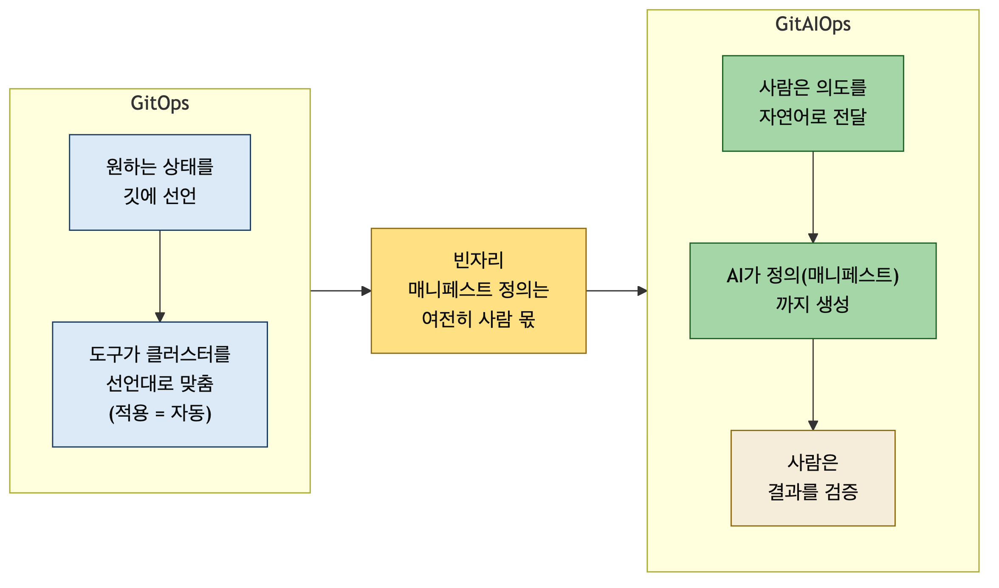
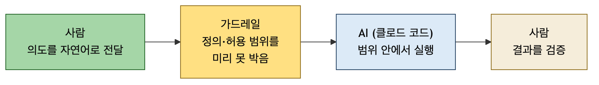
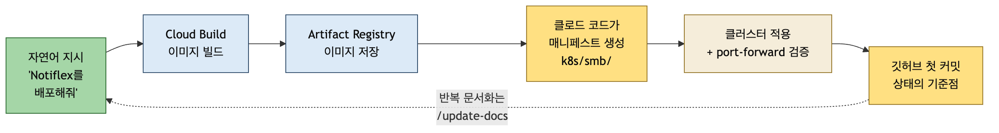

# 개발자가 AI와 함께 인프라를 다룬다는 것 — GKE에 첫 배포를 해보며

> 티스토리 게시용 초안입니다. 직접 다듬어 쓰세요.
> 이미지는 `assets/` 폴더의 PNG를 업로드하고, `[스크린샷: ...]` 자리는 직접 캡처해 넣으세요(민감정보 마스킹).

---

## 1. 개발자는 인프라를 알아야 하는가?

> **You build it, you run it.**
> 직접 만들었으면, 직접 운영하라.

2006년, 아마존 CTO 베르너 포겔스와의 인터뷰에서 나온 슬로건입니다. 벌써 20년 전 이야기입니다. 배포와 운영을 운영팀이 전담하던 경계는 지난 몇 년 사이 조용히 허물어졌습니다. 이제는 개발자가 자기 코드가 운영 환경에서 어떻게 배포되고 어떤 방식으로 도는지 알기 위해 쿠버네티스를 배우는 일이 낯설지 않습니다. 쿠버네티스 환경을 직접 구축하는 것까지도요.

최근 AI가 등장하면서 이 장벽은 더 빠르게 허물어지고 있습니다. 이 글은 그 흐름의 끝에 새로 붙은 조각, "AI와 함께 인프라를 다루는 방식"을 직접 해보고 정리한 기록입니다.

### 왜 GitAIOps인가 — 빈자리를 메우는 이야기

배포를 자동화하는 정석은 GitOps입니다. 원하는 상태를 깃에 선언해 두면, 도구(ArgoCD·Flux 등)가 클러스터를 그 선언과 똑같이 맞춰 줍니다. 사람이 클러스터에 직접 명령하지 않고 깃을 통해서만 바꾸니, 지금 무엇이 왜 떠 있는지가 히스토리에 남습니다.

그런데 GitOps가 자동화하는 것은 **적용**이지 **정의**가 아닙니다. "무엇을 원하는 상태로 둘 것인가"를 적은 YAML은 여전히 사람이 씁니다. 매니페스트를 짜고, 옵션을 고르고, 값을 채우는 앞단이 통째로 사람에게 남아 있습니다. GitAIOps는 그 빈자리를 AI와 함께 메우자는 발상입니다. 정의하는 일까지 AI에게 자연어로 맡기고, 사람은 의도를 전하고 결과를 검증합니다.



---

## 2. GitAIOps 실습

책에서는 하나의 서비스가 성장하는 과정을 따라가며 GitAIOps를 배웁니다. 단순한 앱 배포에서 시작해, 서비스가 커지며 생기는 요구사항을 AI와 함께 인프라를 구성해 풀어 갑니다.

| 단계 | 내용 |
|------|------|
| 도입 | Notiflex 시나리오 |
| 환경 구성 | GCP 계정·클로드 코드·gcloud·GKE 클러스터·첫 배포 |
| SMB | GitOps(ArgoCD)·CI(GitHub Actions)·관측 가능성·무중단 배포 |
| 전환기 | 캐시(Valkey)·시크릿 관리·점진적 배포(Canary) |
| 엔터프라이즈 | 규모 확장(멀티 노드풀·멀티테넌시)·위험 작업 통제 |
| 회고 | GitAIOps — 살아있는 운영 표준 |

실습 프로젝트는 **Notiflex**입니다. 고객사 서비스에서 발생하는 이벤트(회원가입·결제·배송 등)를 받아 이메일·SMS·푸시 알림으로 발송하는 서비스입니다. 고객사는 Notiflex API를 호출하기만 하면 되고, 알림 발송의 복잡한 처리는 Notiflex가 담당합니다. 서비스가 성장하면서 인프라도 함께 발전합니다.

API 서버는 Go 표준 라이브러리로 작성돼 있습니다. Go 언어를 몰라도 됩니다. 핵심은 이 앱을 배포하기까지의 과정과 시나리오이고, 외부 프레임워크 없이 표준 라이브러리만 써서 구조가 단순하기 때문입니다.

실습에 사용한 환경은 다음과 같습니다.

- 클라우드: GCP (GKE, 서울 리전)
- 저장소: [github.com/scofe97/GitAIOps](https://github.com/scofe97/GitAIOps)
- AI: Claude Code (Opus 4.8)

---

## 3. 환경 구성 및 배포

### AI 가드레일

매니페스트를 만들고 실제 작업을 수행하는 일은 AI가 맡습니다. 다만 AI가 무슨 작업을 하는지는 사람이 이해하고 막을 수 있어야 합니다. 그래서 하면 안 되는 작업을 명시하고, 어떻게 작업해야 하는지 정확히 지시하는 장치가 필요합니다. 이것이 가드레일입니다.

실습 저장소에는 이 가드레일 파일이 미리 놓여 있습니다. 클로드 코드가 매니페스트를 아무렇게나 만드는 게 아니라, 이 파일이 정한 스펙대로 만듭니다.

클러스터를 만들 때 붙인 `--spot`, `--gateway-api=standard` 같은 옵션도 제가 즉석에서 고른 게 아니라 가드레일에 적혀 있던 값입니다. 사람이 정의를 미리 못 박아 두면, AI는 그 범위 안에서 실행합니다.



### GKE 클러스터 세우기

클러스터를 만들기 전에 계정·프로젝트·리전이 맞는지, 결제와 필요한 API가 켜져 있는지 확인합니다. GKE는 결제 계정이 열려 있어야(billing enabled) 생성되고, container.googleapis.com API가 켜져 있어야 합니다.

```bash
gcloud config list                             # account·project·zone 확인
gcloud services enable container.googleapis.com cloudbuild.googleapis.com artifactregistry.googleapis.com
gcloud billing projects describe <프로젝트ID>    # billingEnabled: true 확인
```

사전작업이 모두 진행되었다면, 클로드 코드에게 "GKE 클러스터를 만들어 줘"라고 전달해 클러스터를 구축합니다. 실제로 나간 명령은 아래와 같습니다.

```bash
gcloud container clusters create notiflex-cluster \
  --zone=asia-northeast3-a \
  --machine-type=e2-medium \
  --num-nodes=2 \
  --spot \
  --gateway-api=standard \
  --disk-size=30
```

이제 Notiflex를 배포할 매니페스트도 클로드에게 요청합니다. "이 앱을 배포할 매니페스트를 만들어 줘"라고 진행합니다. 프로젝트 구조를 읽고 Namespace·Deployment·Service 세 개를 만들었습니다. 각각 리소스를 담을 공간, 앱을 어떻게 실행할지, 트래픽을 어디로 보낼지를 정의합니다.

```yaml
# namespace.yaml — 리소스를 담을 논리 공간
apiVersion: v1
kind: Namespace
metadata:
  name: notiflex
```

```yaml
# deployment.yaml — 이미지를 어떤 replicas로 실행할지
apiVersion: apps/v1
kind: Deployment
metadata:
  name: notiflex-api
  namespace: notiflex
spec:
  replicas: 2                       # Pod 하나가 죽어도 서비스가 유지되는 최소 구성
  selector:
    matchLabels:
      app: notiflex-api
  template:
    metadata:
      labels:
        app: notiflex-api
    spec:
      containers:
        - name: notiflex-api
          image: asia-northeast3-docker.pkg.dev/<PROJECT_ID>/notiflex/api:v0.1.0
          ports:
            - containerPort: 8080   # main.go의 ListenAndServe(":8080")와 일치
          readinessProbe:           # 트래픽 받을 준비가 됐는지 — 실패하면 엔드포인트에서 제외
            httpGet:
              path: /health
              port: 8080
          livenessProbe:            # 살아있는지 — 실패가 지속되면 컨테이너 재시작
            httpGet:
              path: /health
              port: 8080
          resources:
            requests:
              cpu: 50m
              memory: 32Mi
            limits:
              cpu: 200m
              memory: 128Mi
```

```yaml
# service.yaml — Pod로 들어오는 트래픽을 라우팅
apiVersion: v1
kind: Service
metadata:
  name: notiflex-api
  namespace: notiflex
spec:
  type: ClusterIP        # 클러스터 내부용 — 외부 노출은 5장 Gateway API에서
  selector:
    app: notiflex-api    # 이 라벨을 가진 Pod로 트래픽 전달
  ports:
    - port: 80           # Service가 노출하는 포트
      targetPort: 8080   # Pod 컨테이너 포트
```

한 줄씩 YAML을 쓰는 대신 의도만 전달했고, 제가 한 일은 이 결과를 읽고 검증한 뒤 적용한 것입니다. 이미지 태그를 `latest`가 아닌 `v0.1.0`으로 둔 것, 헬스체크 경로를 `/health`로 잡은 것 모두 가드레일이 정한 규칙을 따른 결과입니다.

### 이미지 빌드와 Artifact Registry 저장

클러스터가 실행하는 것은 소스 코드가 아니라 컨테이너 이미지입니다. 그래서 배포에 앞서 이미지를 만들어야 합니다. Artifact Registry 저장소를 먼저 만들고, Cloud Build로 소스를 올려 빌드·푸시했습니다.

```bash
gcloud artifacts repositories create notiflex --repository-format=docker --location=asia-northeast3
gcloud builds submit app/ --tag=asia-northeast3-docker.pkg.dev/<PROJECT_ID>/notiflex/api:v0.1.0
```



---

## 4. AI와 인프라를 다룬다는 것 — 남은 생각

이번 실습에서 배운 건 명령어 몇 개가 아니라 일의 분담이 바뀌었다는 감각입니다. 의도는 사람이 자연어로 전하고, 그 의도가 넘지 말아야 할 선은 가드레일이 정의하며, 실제 실행은 AI가 맡습니다.

개발자는 YAML을 한 줄씩 치는 사람에서, 원하는 상태를 선언하고 결과를 검증하는 사람으로 옮겨 갑니다. 그러면서도 "정의"라는 가장 중요한 몫은 여전히 사람 손에 있습니다. 그 정의를 얼마나 촘촘히 박아 두느냐가 AI가 만드는 결과의 품질을 가릅니다.

다음은 이 첫 배포 한 바퀴를 자동으로 돌리는 일입니다. 지금은 제가 손으로 `apply`하고 `commit`했지만, 여기에 ArgoCD를 붙이면 깃에 커밋하는 순간 클러스터가 알아서 따라옵니다. 그 이야기는 다음 글에서 이어 가겠습니다.
